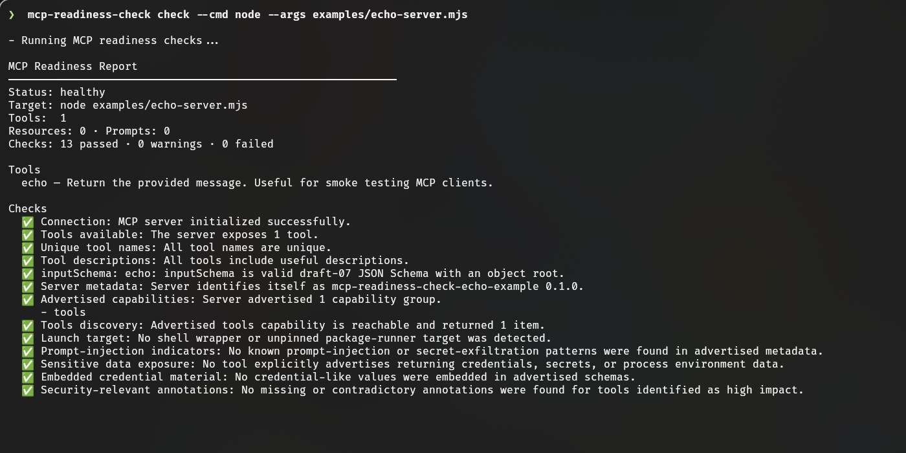
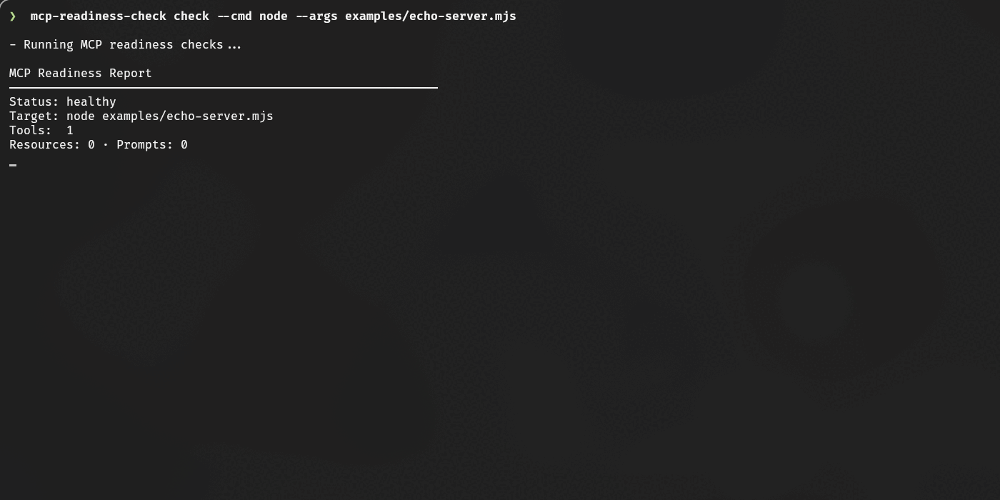

# MCP Readiness Check

**English** · [Español](README.md)

> Verify what a stdio MCP server actually advertises before connecting it to an agent.

[](https://github.com/AvilaCarlosDev/mcp-readiness-check/actions/workflows/ci.yml)
[](LICENSE)
[](package.json)
[](https://modelcontextprotocol.io/)

MCP Readiness Check launches a server over stdio, performs a real MCP handshake, inventories every advertised catalog page, validates tool contracts, runs a static security audit, and produces reviewable reports.



<details>
<summary>Watch the CLI demo</summary>



</details>

## Verified checks

| Area | What is checked |
|---|---|
| Connection | Initialization, timeout behavior, server identity, and actionable failure output |
| Capabilities | Advertised groups, server identity, and tools/resources/prompts compared with successful discovery |
| Catalogs | All pages of tools, resources, and prompts advertised by the server |
| Tool quality | Unique and portable names, useful descriptions, and annotation consistency |
| JSON Schema | Full meta-schema compilation for draft-07, 2019-09, and 2020-12 input/output schemas |
| Static security | Tool-poisoning indicators, embedded credential material, sensitive inputs, and risky or contradictory annotations |
| Secret handling | Environment values, credential arguments, authorization headers, provider-key patterns, nested sensitive fields, and stderr |
| Automation | Console, JSON, and Markdown reports with non-zero exit codes for failed checks |

## Install

```bash
npm install --global @avilacarlosdev/mcp-readiness-check
```

The package is `@avilacarlosdev/mcp-readiness-check`; the installed executable is `mcp-readiness-check`.

Run without a global installation:

```bash
npx @avilacarlosdev/mcp-readiness-check --help
```

## Quick start

```bash
mcp-readiness-check check --cmd node --args examples/echo-server.mjs
```

Test a published stdio server:

```bash
mcp-readiness-check check \
  --cmd npx \
  --args -y @modelcontextprotocol/server-everything
```

## Configuration

```bash
mcp-readiness-check init
mcp-readiness-check check --server filesystem
```

```json
{
  "servers": {
    "filesystem": {
      "command": "npx",
      "args": ["-y", "@modelcontextprotocol/server-filesystem", "."],
      "cwd": "."
    }
  }
}
```

The default file is `mcp-readiness.config.json`. Use `--config <path>` to select another file.
`init` refuses to overwrite an existing file unless `--force` is supplied.

## Reports

```bash
mcp-readiness-check check --server filesystem --json
mcp-readiness-check check --server filesystem --markdown readiness-report.md
```

See [report.example.md](report.example.md) for a complete Markdown example.

## Static security audit

The audit evaluates evidence exposed during initialization and catalog discovery. It detects:

- known prompt-injection and secret-exfiltration language in tool descriptions or server instructions;
- tools that explicitly advertise returning credentials, secrets, or process environment data;
- credential-like schema fields containing defaults, constants, examples, or enum values;
- high-impact tools whose safety annotations are missing or contradictory;
- sensitive inputs that deserve logging and persistence review.
- shell-wrapped launch commands and unpinned package-runner targets.

Findings based on behavior keywords are explicitly labeled as heuristic and require human review. Values that resemble credentials are never included in finding details.

Use `--no-security-audit` only when you intentionally want schema and capability checks without these findings.

## Secret redaction

Reports redact every supplied environment value plus common credential patterns in arguments, metadata, schemas, diagnostics, resource URIs, prompts, and captured stderr.

Redaction is defense in depth. Prefer environment variables or a secret manager, and inspect artifacts before sharing them. Report missed patterns privately through [SECURITY.md](SECURITY.md).

## CI

A failed check exits with code `1`; warnings do not fail the command.

```yaml
- name: Verify MCP readiness
  run: mcp-readiness-check check --cmd node --args dist/server.js
```

## Options

| Flag | Default | Purpose |
|---|---|---|
| `--cmd <command>` | — | Server command to launch over stdio |
| `--args <args...>` | — | Arguments passed to the server command |
| `--server <name>` | — | Named server from the config file |
| `--config <path>` | `mcp-readiness.config.json` | Config file location |
| `--cwd <path>` | current directory | Working directory for the server |
| `--timeout <ms>` | `15000` | Timeout per MCP operation |
| `--json` | off | Print a machine-readable report |
| `--markdown <path>` | — | Write a Markdown report |
| `--no-security-audit` | off | Disable static security findings |

## Untrusted server output

Everything a server advertises (tool, resource and prompt names and descriptions, check messages, `stderr`) is treated as untrusted. Before it reaches the console or a Markdown report, control characters and text-reordering characters are shown as visible escapes (`\x1b`, `\u202e`) instead of being interpreted. This stops a hostile server from clearing the screen, changing the terminal title, writing to the clipboard (OSC 52) or faking report lines. In Markdown reports, links, HTML and code fences coming from the server are neutralized. The `--json` output keeps the original data, with JSON escaping.

## Scope and limits

- stdio transport only;
- catalogs and contracts are inspected, but tools are not executed;
- the security audit is static analysis of advertised metadata, not a runtime penetration test;
- unsupported JSON Schema dialects fail explicitly instead of being silently accepted;
- catalog size, pagination, schema size, and captured stderr have defensive limits;
- Streamable HTTP and opt-in safe tool probes are future work.

The project complements, rather than replaces, the interactive [MCP Inspector](https://github.com/modelcontextprotocol/inspector).

## Development

```bash
npm ci
npm test
npm run test:coverage   # enforces a coverage threshold
npm run build
npm run pack:check
npm run demo:assets:portable
npm run dev -- check --cmd node --args examples/echo-server.mjs
```

The README media was captured from a real Kitty session running the CLI. `npm run demo:assets:portable` generates separate portable assets from the same real CLI output when a compositor capture is unavailable. It requires Google Chrome and ImageMagick locally; neither is needed to build or use the package.

## Documentation

- [English guide](docs/en/guide.md)
- [Guía en español](docs/es/guia.md)
- [Contributing](CONTRIBUTING.md) · [Security policy](SECURITY.md) · [Code of conduct](CODE_OF_CONDUCT.md) · [Changelog](CHANGELOG.md)

## Credits

Created and maintained by [Carlos Avila](https://github.com/AvilaCarlosDev). Developed with the support of Claude (Anthropic) as an assistant for architecture review and test writing; design decisions and final review are the author's.

## License

MIT — see [LICENSE](LICENSE).
